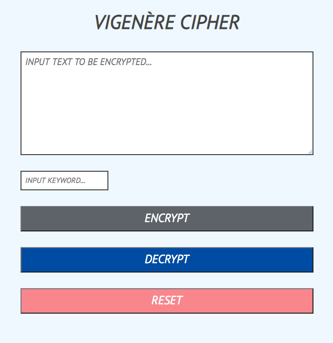

# Vigenère Cipher

## General Information:
Vigenère Cipher that takes in an input message and key then displays the encrypted message.

## Screenshot:

## Technologies:
- HTML
- CSS
- Vanilla Javascript

## Setup: 
The live version of the webpage can be seen [here](https://tpsst5.github.io/vigenere_cipher/).
## Status:
This project is complete.